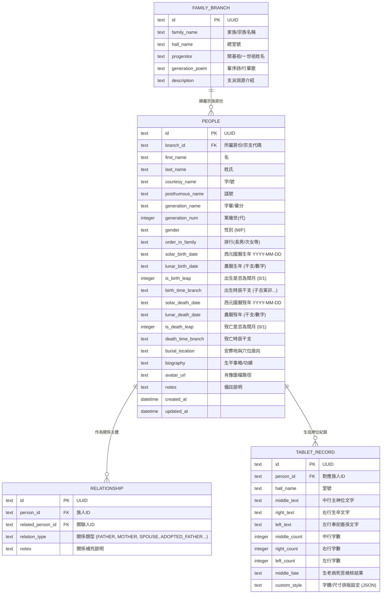

# 尋根系統（FindRoot）：祖先牌位與族譜管理系統規格書 (SPEC.md)

---

## 1. 專案簡介 (Overview)

「尋根系統（FindRoot）」是一套專為華人家族族譜編修、世系傳承與祖先牌位整理所設計的數位化管理工具。系統整合**農曆與國曆雙向轉換**、**生卒年月日時辰天干地支對照**、**祖先牌位中行「兩生合一老」字數格式規範自動校驗**，並能基於父母與配偶關係自動繪製**世系圖（族譜樹）**與產出標準祖先牌位內外牌排版。

本系統前端採用現代化 **Vue.js 3** 響應式架構，後端採用 **Node.js** 配搭輕量級本機資料庫 **SQLite**，具備可攜性高、易部署、免複雜資料庫維護之優勢。

---

## 2. 系統技術選型 (Tech Stack)

| 層級 | 技術 / 套件 | 說明 |
| :--- | :--- | :--- |
| **前端框架** | Vue 3 (Composition API, `<script setup>`) + Vite | 現代化高效能前端建置工具 |
| **程式語言** | TypeScript / JavaScript | 強型別支援，降低資料型別轉換錯誤 |
| **UI 樣式庫** | Tailwind CSS + Element Plus (或 Naive UI) | 提供典雅、現代且具東方美學的視覺元件 |
| **族譜視覺化** | D3.js / Vue Flow / SVG 渲染 | 支援階層式世系圖、縮放平移、收合節點 |
| **曆法引擎** | `lunar-javascript` | 精確支援西元 1900～2100 年國曆、農曆、天干地支、生肖、閏月與時辰八字轉換 |
| **牌位產生排版** | CSS Writing Mode (vertical-rl) + Canvas/HTML2Canvas/PDFKit | 直書排版、書法字體支援、祖先神主牌預覽與列印 |
| **後端伺服器** | Node.js + Express (或 Fastify) | 輕量高效率 RESTful API 服務 |
| **資料庫系統** | SQLite3 (搭配 `better-sqlite3` 或 `knex`) | 單一檔案儲存、備份遷移極為簡便、效能卓越 |
| **資料匯出匯入** | JSON, CSV, PDF, PNG | 支援備份封存與實體輸出列印 |

---

## 3. 核心功能規格 (Functional Specifications)

### 3.1 族人成員與生平資料管理 (Member Profile Management)
1. **基本資訊**：
   - 姓名、字號、號、諡號。
   - 性別（男、女）。
   - 堂號（如：隴西堂、穎川堂、濟陽堂等）。
   - 字輩（派語、行輩），如「德、澤、長、流」。
   - 排行（如：長男、次男、長女、養子、過繼嗣子等）。
2. **生卒年月日時**：
   - 出生日期：國曆（年-月-日）或農曆（年-月-日-閏月旗標）輸入，並可選擇出生吉時（子丑寅卯等十二時辰）。
   - 歿亡日期：國曆或農曆、時辰、享年/享壽（系統自動計算歲數）。
   - 葬地、安葬穴位或納骨塔座向（如：座北朝南、仙命堪輿註記）。
3. **世系關係鏈結**：
   - 父親識別碼（Father ID）、母親識別碼（Mother ID）。
   - 配偶關聯（Spouse IDs），支援元配、繼室、多配偶標註。
   - 過繼/承嗣關係註記（本生父母與出嗣父母）。
4. **生平事蹟與檔案**：
   - 簡傳、功績、學歷官職、遺像或老照片上傳。

---

### 3.2 國曆與農曆雙向精準轉換引擎 (Calendar Conversion Engine)
1. **即時雙向轉換**：
   - 輸入西元國曆日期時，自動換算並顯示農曆年月日、閏月狀態。
   - 輸入農曆年月日（可勾選閏月），自動推算回西元國曆日期。
2. **天干地支與八字時辰推算**：
   - 自動帶出干支年（如「甲子年」）、生肖（如「鼠」）、干支月、干支日與時辰（如「吉時申時」）。
3. **歷史朝代年號對照（選配擴充）**：
   - 支援清朝、民國與西元年號輸入轉譯（如民國前五年、光緒三十二年），方便謄錄古族譜資料。

---

### 3.3 祖先牌位排版與格式校驗 (Ancestor Tablet Formatter)
傳統祖先牌位講求文字對稱與吉凶字數，本系統內建格式化工具：
1. **「兩生合一老」字數驗證規則**：
   - 牌位神主字數依「生、老、病、死、苦」循環計算。
   - **中行（神主主文）**：需落在「老」（7、12、17、22 字）或「生」字位。
   - **左行（生者奉祀）與右行（生卒時辰）**：字數需合「生」（6、11、16 字）或「老」。
   - 若字數不合，系統提供字數警告與增減字調整建議（如加「諱」、「府君」、「公」、「孺人」等字）。
2. **牌位模板規範**：
   - 男考神主格式：`顯考 [姓] 公 諱 [名] 府君 之神主/之神位`
   - 女妣神主格式：`顯妣 [姓] 門 [本姓] 氏 諡 [諡號] 孺人 之神主/之神位`
   - 歷代總牌格式：`[堂號] [姓氏] 門歷代祖先之神位`
3. **牌位視覺化預覽與列印**：
   - 模擬傳統木雕神主牌金字/黑字、紅底/木紋底色。
   - 支援內牌（九代祖、列代內抽木牌）多頁清單排版與快速預覽列印。

---

### 3.4 世系圖與族譜視覺化 (Genealogy & Pedigree Chart)
1. **樹狀世系圖（Family Tree View）**：
   - 提供以任一族人為「根節點」或「中心節點」向上展開直系祖先（Ancestors Tree）或向下開展後裔世系（Descendants Tree）。
   - 節點支援展開/收合、拖曳縮放（Pan & Zoom）。
   - 節點資訊卡：顯示世數（第幾代）、姓名、字輩、生卒年（國/農曆干支）、配偶名。
2. **傳統歐蘇二式族譜排版預覽**：
   - **歐陽修式（五世一圖）**：每五代一排，直觀清晰。
   - **蘇洵式（垂珠體/吊線體）**：以世代平行排列，上下線條牽引。
3. **尋根路徑追蹤**：
   - 選擇兩個族人，自動推算親屬稱謂與世系距離（如：曾祖父、堂兄弟、從姪）。

---

### 3.5 匯出與備份 (Import / Export / Print)
1. **備份與還原**：一鍵將整個族譜資料庫導出為單一 `.json` 或 `.sqlite` 檔案。
2. **牌位紙樣列印**：產生符合公分尺寸（一尺二、八寸八等常用神主尺寸）的 PDF 列印稿。
3. **族譜書冊匯出**：匯出世系表清單為 Excel/CSV 或格式化印製 PDF。

---

## 4. 資料庫架構設計 (Database Schema)

本專案使用 SQLite，建立以下核心資料表：



---

## 5. 後端 RESTful API 規格 (Backend API Endpoints)

所有 API 均以 `/api/v1` 為基底路徑，回應統一格式為 JSON。

### 5.1 族人成員 (Members)
- `GET /api/v1/members` - 取得成員列表（支援依姓名、世代、性別關鍵字搜尋與分頁）
- `GET /api/v1/members/:id` - 取得單一成員詳細資料（含父母、配偶與子女清單）
- `POST /api/v1/members` - 新增族人資料（可同時綁定父母與配偶關係）
- `PUT /api/v1/members/:id` - 修改成員基本生平與生卒資訊
- `DELETE /api/v1/members/:id` - 刪除成員資料（防呆提示相關世系鏈結）

### 5.2 世系關係與圖譜 (Genealogy & Pedigree)
- `GET /api/v1/genealogy/tree` - 取得族譜樹狀資料結構（可指定 rootId、世代深度）
- `POST /api/v1/genealogy/relationship` - 建立或更新兩人間的親屬關係（父母、配偶、過繼等）
- `DELETE /api/v1/genealogy/relationship/:id` - 解除親屬關係

### 5.3 曆法轉換公用工具 (Calendar Utility)
- `POST /api/v1/calendar/solar-to-lunar` - 輸入西元國曆日期與時辰，回傳農曆年月日時、干支、生肖、節氣
- `POST /api/v1/calendar/lunar-to-solar` - 輸入農曆年月日（含閏月選項），回傳對應西元日期

### 5.4 祖先牌位格式化與檢查 (Tablet Utility)
- `POST /api/v1/tablet/format` - 根據成員 ID 或自訂姓名生卒，自動排定中、左、右行文字
- `POST /api/v1/tablet/validate` - 驗證文字字數是否合乎「生老病死苦」（老/生吉數規範）
- `GET /api/v1/tablet/:personId` - 取得特定族人的牌位預覽資料

### 5.5 系統設定與匯出匯入 (System & Backup)
- `GET /api/v1/export/json` - 匯出全庫 JSON 備份
- `POST /api/v1/import/json` - 匯入 JSON 備份檔
- `GET /api/v1/branch/info` - 取得宗族、堂號與字輩詩設定

---

## 6. 前端架構與介面模組 (Frontend Architecture)

### 6.1 前端目錄規劃 (Directory Structure)
```
frontend/
├── src/
│   ├── assets/              # 書法字型、牌位木紋背景圖、印章樣式
│   ├── components/
│   │   ├── calendar/        # 國農曆雙向切換選取器 (LunarDatePicker.vue)
│   │   ├── tree/            # 族譜樹狀圖元件 (GenealogyTree.vue, MemberNode.vue)
│   │   ├── tablet/          # 祖先牌位預覽與排版器 (AncestorTablet.vue, RuleChecker.vue)
│   │   └── common/          # 通用卡片、彈窗、表單元件
│   ├── views/
│   │   ├── Dashboard.vue    # 宗族儀表板 (成員總數、世代統計、堂號概況)
│   │   ├── MemberList.vue   # 成員列表與快速檢索
│   │   ├── MemberDetail.vue # 成員生平檔案編輯與生卒曆法轉換
│   │   ├── TreeView.vue     # 互動世系圖（平移縮放、直式/橫式切換）
│   │   ├── TabletStudio.vue # 祖先牌位工作室（規格校驗、內牌多頁、列印排版）
│   │   └── Settings.vue     # 堂號、行輩字輩詩與備份匯出設定
│   ├── services/            # API 客戶端 (axios / fetch封裝)
│   ├── utils/               # lunar-javascript 曆法換算與生老病死苦演算法
│   └── store/               # Pinia 狀態管理 (當前選取族人、樹圖過濾器等)
```

### 6.2 牌位排版核心演算法示意 (生老病死苦)
牌位主文字數計算原則：
$$\text{字數} \pmod 5 = \begin{cases} 1 & \text{生 (吉)} \\ 2 & \text{老 (吉)} \\ 3 & \text{病 (凶)} \\ 4 & \text{死 (凶)} \\ 0 & \text{苦 (凶)} \end{cases}$$
- 中行神位：必須滿足餘數為 $2$（合「老」，如 7、12、17、22 字）或餘數為 $1$（合「生」）。
- 左右行：以合「生」或「老」為準。

---

## 7. 專案目錄結構 (Full Project Layout)

```
FindRoot/
├── SPEC.md                  # 本系統詳細規格設計書
├── package.json             # Root 專案設定 (monorepo 或 scripts)
├── backend/                 # Node.js + SQLite 後端服務
│   ├── package.json
│   ├── src/
│   │   ├── index.js         # 伺服器入口
│   │   ├── db/              # SQLite 初始化、Migrations 與種子資料
│   │   │   └── database.sqlite
│   │   ├── routes/          # API 路由 (members, tree, tablet, calendar)
│   │   ├── controllers/     # 業務邏輯控制器
│   │   └── utils/           # 曆法計算與字數校驗模組
├── frontend/                # Vue 3 前端單頁應用
│   ├── package.json
│   ├── vite.config.js
│   ├── index.html
│   └── src/ ...
```

---

## 8. 開發里程碑 (Milestones & Roadmap)

1. **第一階段（基礎核心與資料層）**：
   - 建立 Node.js + SQLite 後端結構與資料庫 Schema。
   - 建立 Vue 3 + Tailwind CSS 前端基礎介面。
   - 整合 `lunar-javascript` 完成國曆/農曆/干支雙向換算功能。
2. **第二階段（成員生平與牌位排版系統）**：
   - 成員生平檔案 CRUD 與父母/配偶關聯設定。
   - 祖先牌位視覺化排版產生器（生老病死苦字數智慧提示、直式預覽、列印樣式）。
3. **第三階段（世系圖與族譜視覺化）**：
   - 實作互動式家族世系樹（Tree Diagram），支援節點展開/收合、世代分層。
   - 族譜清單檢索與分支切換。
4. **第四階段（驗證、匯出與完善）**：
   - 資料庫一鍵 JSON 備份與還原。
   - 支援牌位印刷 PDF 匯出與完整測試。
